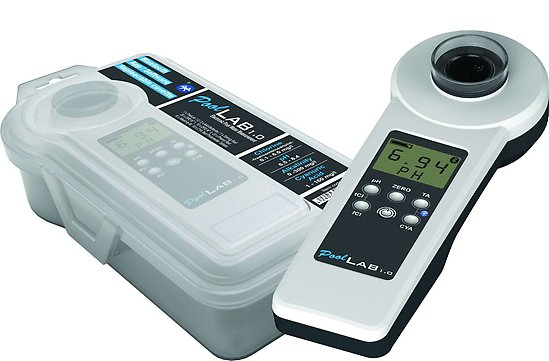
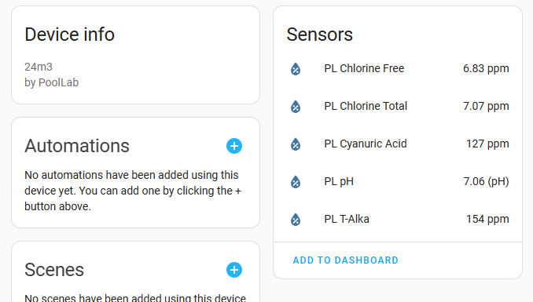

# python_poollab
Python API for Pool Lab 1.0
For now only fetching all data and parsing to classes.

## Stand-alone usage
`$ python main.py -t "API_TOKEN_FROM_https://labcom.cloud/pages/user-setting"`

## Home Assistant integration

### Install
1. Go to HACS -> Integrations
2. Click the three dots on the top right and select `Custom Repositories`
3. Enter `https://github.com/dala318/python_poollab` as repository, select the category `Integration` and click Add
4. A new custom integration shows up for installation (PoolLab) - install it
5. Restart Home Assistant

### Configuration
1. Get a API token to your cloud data from https://labcom.cloud/pages/user-setting
2. Klick Add integration and select "poollab"
3. In the configuration window enter the API token
4. Each pool in your account should be shown as an own device which you can add to a room

### Entity attributes
Each sensor entity has the value of the last measurement of each parameter, based on the timestamp from device (not the one stored last)
In addition some attributes are provided
* `Measured at`: The device timestamp at measure
* `Measure`: The unique id of the measure
* `Ideal low`: Lower limit for ok
* `Ideal high`: Upper limit for ok
* `Device serial`: Device serial of the device that made the measure
* `Operator name`: Mane of operator that did the measurement
* `Comment`: Comment to measurement
